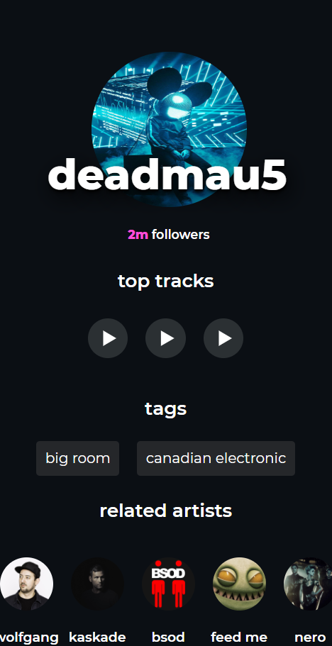

# Spotify Player

Spotify player is an application that uses the Spotify API and shows information like top tracks, genres and related artists. Also, you can listen three of the top tracks of a an artist.

## TECH STACK

- React
- NodeJS and express
- Spotify API

## RUN LOCALLY

clone using https://github.com/Charles9869/Spotify-Player.git

## SCREENSHOTS

### Main page

